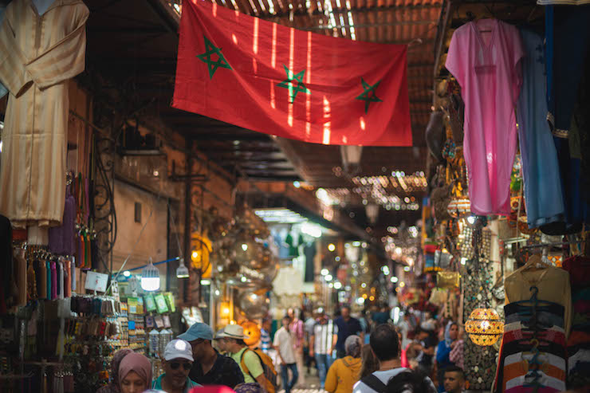
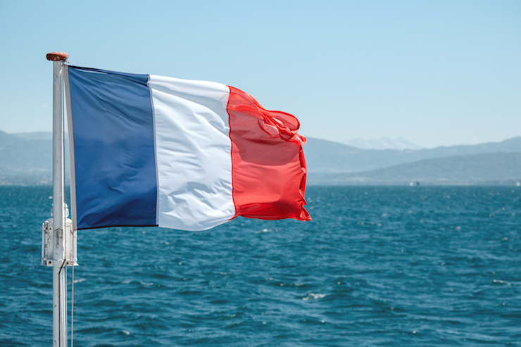
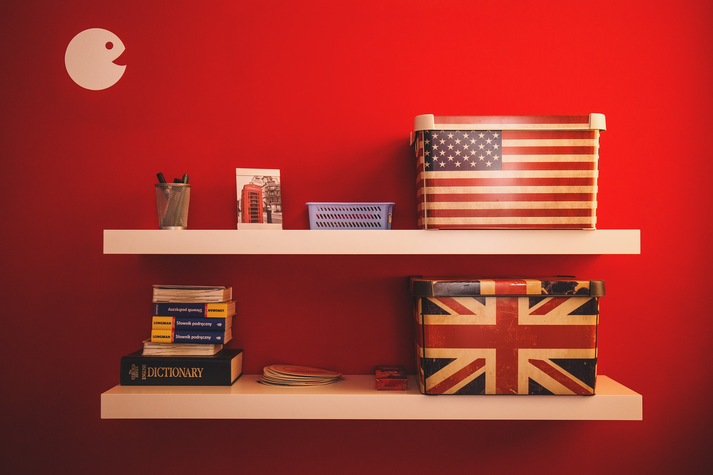
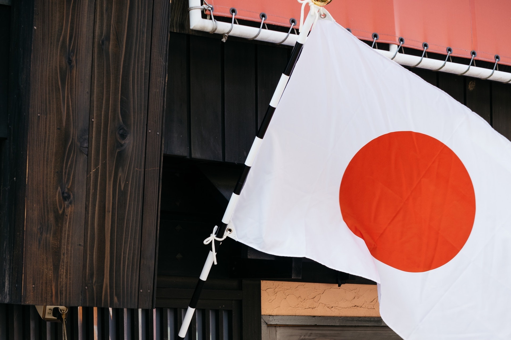

<main id="nos-metiers" class="centre-langues">

  <section class="container mt-4 mt-sm-5 pt-5 pb-4">
    

      <h1 class="font-weight-normal mb-4">
        <strong>Renforcez vos langues</strong>
      </h1>
    

    

      A Bookmania, nous sommes convaincus que <strong>l’apprentissage d’une langue</strong> ne peut se faire qu’à <strong>effectif réduit</strong>. A cet effet, nous avons mis en place un programme d’apprentissage et de <strong>perfectionnement</strong> pour des groupes de 6 personnes maximum.
    

    

      Nous proposons trois groupes de niveaux :
    

    <ul class="list-unstyled">
      <li>
        <i class="fas fa-check mx-3"></i>
        <strong>Débutants</strong>
      </li>
      <li>
        <i class="fas fa-check mx-3"></i>
        <strong>Intermédiaires</strong>
      </li>
      <li>
        <i class="fas fa-check mx-3"></i>
        <strong>Avancés</strong>
      </li>
    </ul>
    

      L’affectation à l’un de ces groupes se fait à l’issu d’un test de niveau qui se fait lors de l’inscription.
    

    

      Nous nous appuyons également dans notre processus d’apprentissage sur des <strong>partenariats de prestige et d’excellence.</strong> Nous pourrons ainsi accompagner pour passer avec brio les différentes certifications existantes dans les langues que nous enseignons.
    

  </section>

  <section class="pt-5 pb-3 blue-grey lighten-5">
    

      

        

          

            

              <a href="{{site.baseurl}}/apprendre-darija-casablanca.php">
                <h2 class="text-center">
                  <strong class="text-white">Apprendre la darija</strong>
                </h2>
                
              </a>
            

            

              <a href="{{site.baseurl}}/apprendre-darija-casablanca.php" class="btn btn-outline-primary waves-effect waves-light">
                <strong>En savoir plus</strong>
              </a>
            

          

        

        

          

            

              <a href="{{site.baseurl}}/apprendre-francais-casablanca.php">
                <h2 class="text-center">
                  <strong class="text-white">Apprendre le français</strong>
                </h2>
                
              </a>
            

            

              <a href="{{site.baseurl}}/apprendre-francais-casablanca.php" class="btn btn-outline-primary waves-effect waves-light">
                <strong>En savoir plus</strong>
              </a>
            

          

        

        

          

            

              <a href="{{site.baseurl}}/apprendre-anglais-casablanca.php">
                <h2 class="text-center">
                  <strong class="text-white">Apprendre l'anglais</strong>
                </h2>
                
              </a>
            

            

              <a href="{{site.baseurl}}/apprendre-anglais-casablanca.php" class="btn btn-outline-primary waves-effect waves-light">
                <strong>En savoir plus</strong>
              </a>
            

          

        

        

          

            

              <a href="{{site.baseurl}}/apprendre-espagnol-casablanca.php">
                <h2 class="text-center">
                  <strong class="text-white">Apprendre l'espagnol</strong>
                </h2>
                
              </a>
            

            

              <a href="{{site.baseurl}}/apprendre-espagnol-casablanca.php" class="btn btn-outline-primary waves-effect waves-light">
                <strong>En savoir plus</strong>
              </a>
            

          

        

        

          

            

              <a href="{{site.baseurl}}/apprendre-japonais-casablanca.php">
                <h2 class="text-center">
                  <strong class="text-white">Apprendre la japonais</strong>
                </h2>
                
              </a>
            

            

              <a href="{{site.baseurl}}/apprendre-japonais-casablanca.php" class="btn btn-outline-primary waves-effect waves-light">
                <strong>En savoir plus</strong>
              </a>
            

          

        

      

    

  </section>

</main>

