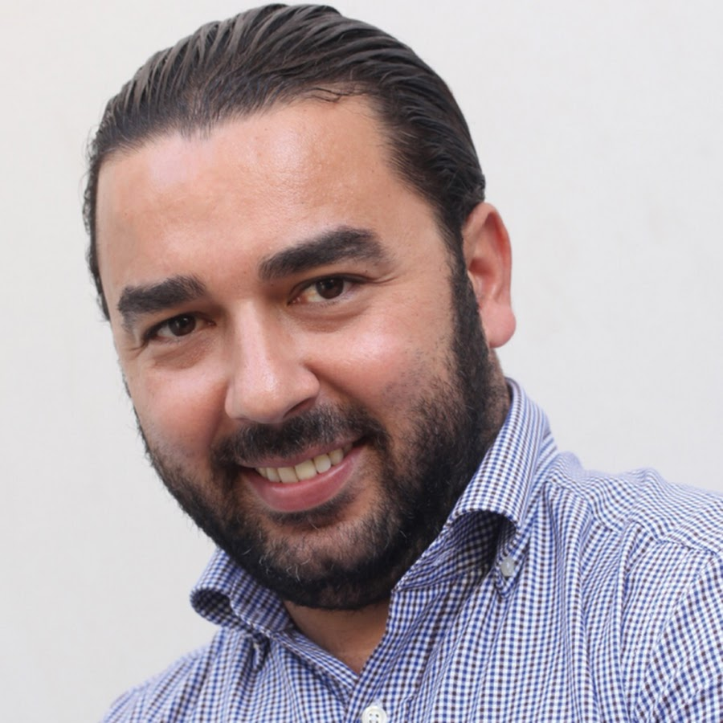

<main id="qui-sommes-nous">

  <section class="container mt-4 mt-sm-5 pt-5 pb-2">
<!--     

      <h1 class="font-weight-normal">
        <strong>Mot du fondateur</strong>
      </h1>
    
 -->
    

      

        
        <h5 class="mt-3">
          <strong class="font-weight-bold">Ismail Boukili</strong>
        </h5>
      

      

        <h1 class="pb-2 d-none d-md-block font-weight-normal">
          <strong>A chacun son rythme</strong>
        </h1>
        

          Combien de fois ai-je entendu des parents d'élèves ou des professeurs qualifier tel élève de <strong>«cas désespéré»</strong>. Au nom de quel autorité nous arrogeons-nous le droit de condamner un élève à vie, car c'est bien de cela qu'il s'agit quand on utilise le vocable de «cas désespéré» ?
        

        

          Aujourd'hui encore, il n'est pas rare qu'un parent d'élève me contacte et me lance avec une grande tristesse teintée de désespoir dans les yeux : « Je ne comprends pas <strong>pourquoi mon enfant a des difficultés en maths</strong>. A son âge, j’étais bien meilleur que lui. »
        

        

          Comprenez qu'il n'y a rien d'héréditaire ni de génétique. Et surtout, gardez en tête comme une vérité absolue qu'<strong>il n'y a pas de bons ou de mauvais élèves en mathématiques.</strong>
          Il y a ceux qui ont révélé leurs potentialités et ceux qui n'ont pas encore déployé leurs ailes. <strong>A chacun son rythme</strong>.
        

        

          Car c'est bien de cela qu'il s’agit : les mathématiques sont finalement un jeu, et les problèmes ne sont qu'une série de challenges à relever, qui pourrait dire le contraire ? Combien d'élèves catalogués comme «allergiques» aux mathématiques ai-je vu décrocher un bac scientifique haut la main pour ensuite intégrer les meilleures écoles d’ingénieurs ?
        

      

      

        
        <h5 class="mt-3">
          <strong class="font-weight-bold">Ismail Boukili</strong>
        </h5>
      

    

  </section>

  <section class="pt-5 pb-5 blue-grey lighten-5">
    

      <h3 class="font-weight-normal mb-4">
        <strong>Notre vision à Bookmania :</strong> s'adapter à nos élèves pour les faire progresser
      </h3>
      

        Il n’existe aucune approche universelle pouvant s’appliquer à tous les élèves. En effet chaque élève, chaque personne est un être à part, nous avons donc mis en place une <strong>méthodologie évolutive</strong> pouvant <strong>s’adapter aux spécificités de
        chaque personne</strong>. Enfin, nous restons convaincus que <strong>notre réussite</strong> passe par celle de nos élèves et par <strong>la satisfaction de nos clients</strong>.
      

    

  </section>

</main>

