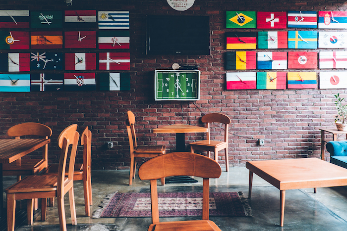

---
# Feel free to add content and custom Front Matter to this file.
# To modify the layout, see https://jekyllrb.com/docs/themes/#overriding-theme-defaults

layout: default
title: Soutien scolaire à Casablanca
---
<!-- Banner -->

  <!-- Mask & flexbox options-->
  

    <!-- Banner Content -->
    

      <h2 class="mb-4">
        <strong>Numéro 1 de l'accompagnement scolaire à Casablanca</strong>
      </h2>
      <a href="#main" class="btn btn-outline-white btn-lg waves-effect waves-light">
        Consultez nos services
      </a>
    

    

  

<!-- Content -->
<main id="main">
  <!--Section: Main info-->
  <section class="container pt-5 pb-5 wow fadeIn" style="visibility: visible; animation-name: fadeIn;">

    <!--Grid row-->
    

      

        <!-- Card -->
        

          <!-- Card image -->
          

            
            <a href="/">
              

            </a>
          

          <!-- Card content -->
          

            <i class="fas fa-landmark fa-2x mb-2"></i>
            <!-- Title -->
            <h5 class="blue-text">
              <strong>Soutien scolaire</strong>
            </h5>
            <!-- Text -->
            
Tous niveaux, Toutes matières

            <!-- Button -->
            <a class="btn btn-outline-primary waves-effect waves-light">
              <strong>Lire la suite</strong>
            </a>
          

        

      

      

        <!-- Card -->
        

          <!-- Card image -->
          

            
            <a href="/">
              

            </a>
          

          <!-- Card content -->
          

            <i class="fa fa-graduation-cap fa-2x mb-2"></i>
            <!-- Title -->
            <h5 class="pink-text">
              <strong>Examens, tests et concours</strong>
            </h5>
            <!-- Title -->
            
Les clés de la réussite

            <!-- Button -->
            <a class="btn btn-outline-primary waves-effect waves-light">
              <strong>Lire la suite</strong>
            </a>
          

        

      

      

        <!-- Card -->
        

          <!-- Card image -->
          

            
            <a href="/">
              

            </a>
          

          <!-- Card content -->
          

            <i class="fas fa-globe-africa fa-2x mb-2"></i>
            <!-- Title -->
            <h5 class="font-weight-bold indigo-text">
              Centre de langues
            </h5>
            <!-- Text -->
            

              Facilitez l'apprentissage des langues
            

            <!-- Button -->
            <a class="btn btn-outline-primary waves-effect waves-light">
              <strong>Lire la suite</strong>
            </a>
          

        

      

    

  </section>

  <section class="py-5 primary-color">
    

      

        <h5>
          <strong>SOUTIEN SCOLAIRE : 11 formules, 15 matières.</strong>
        </h5>
        Mettons en place la formule qui vous conviendra !
      

       
      <a href="/" class="btn btn-white waves-effect waves-light" data-aos="fade-left">
        <strong>Découvrez nos offres</strong>
      </a>
    

  </section>

  <section class="pt-5 pb-5 blue-grey lighten-5">
    

      <!-- <h1>LE <strong>PROCESSUS</strong></h1> -->
      <!-- 
 -->
      

        

          <a href="/" style="color: #4688F1;">
            

              <i class="fas fa-th fa-4x mb-4"></i>
              
Consultez nos services

            

          </a>
        

        

          <a href="/" style="color: #E62465;">
            

              <i class="fas fa-desktop fa-4x mb-4"></i>
              
Faites une demande

            

          </a>
        

        

          <a href="/" style="color: #00ab6c;">
            

              <i class="fas fa-phone fa-4x mb-4"></i>
              
Recevez notre appel (24h)

            

          </a>
        

        

          <a href="/" style="color: #4054B2;">
            

              <i class="far fa-calendar fa-4x mb-4"></i>
              
Obtenez votre séance

            

          </a>
        

      

      <!-- Button -->
      <a href="/" class="btn btn-outline-primary waves-effect waves-light">
        <strong>Obtenez votre devis</strong>
      </a>
    

  </section>

  <section class="blue-grey lighten-5 text-center pt-5 pb-4" style="background-image: linear-gradient(-225deg, rgba(0,101,168,0.7) 0%, rgba(0,36,61,0.7) 50%), url('https://images.unsplash.com/photo-1498079022511-d15614cb1c02'); background-size: cover; background-position: center;">
    

      <h2 class="mb-4">DES PARENTS ET DES ELEVES <strong>SATISFAITS</strong></h2>

      <!--Carousel Wrapper-->
      

        <!--Indicators-->
        <ol class="carousel-indicators">
          <li data-target="#carousel-testimonies" data-slide-to="0" class="active"></li>
          <li data-target="#carousel-testimonies" data-slide-to="1"></li>
          <!-- <li data-target="#carousel-testimonies" data-slide-to="2"></li> -->
        </ol>
        <!--Slides-->
        

          

            

              <em>"BOOKMANIA est une expérience innovante en matière de soutien et d'accompagnement scolaire et un confort pour les parents. Le coaching et la pédagogie sont adaptés selon le profil de l’élève. Notre fils est en terminale S cette année. Nous sommes très contents du progrès et des résultats. Le nombre d'élèves par cours est très raisonnable, on y travaille les fondamentaux et la méthodologie ! Sincères remerciements à toute l’équipe de BOOKMANIA !"</em>
            

            
<strong>N. Oudghiri</strong>

          

          

            

              <em>"Grâce à BOOKMANIA ma petite protégée a été sauvée d'un redoublement certain. Elle avait perdu toutes ses notions de langue française. Puis grâce au bilan et au suivi personnalisé durant l'été la petite a non seulement repris confiance en elle mais elle a aussi repris les bases et réussi ses examens d'entrée dans une école privée. Merci à toute l'équipe BOOKMANIA !"</em>
            

            
<strong>S. Diouri</strong>

          

        

      

    

  </section>

  <!--Google map-->
  

    

      <iframe src="https://maps.google.com/maps?q=51, avenue Hassan Souktani, Quartier Gautier, 20060, Casablanca Maroc&t=&z=13&ie=UTF8&iwloc=&output=embed" frameborder="0"
        style="border:0" allowfullscreen></iframe>
    

  

</main>

<button class="back-to-top" type="button">
  <i class="fas fa-chevron-up"></i>
</button>
