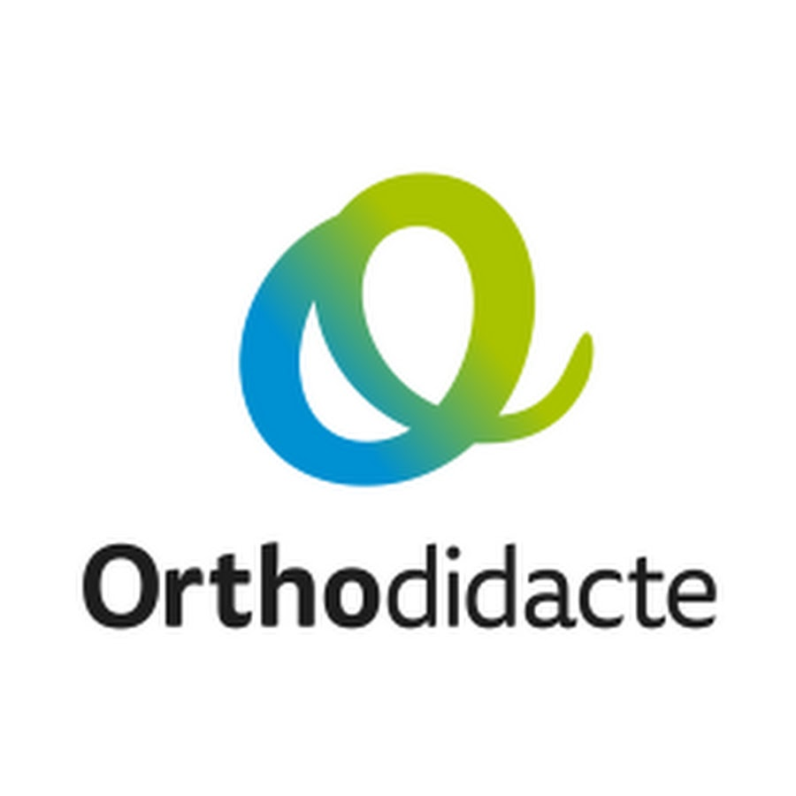

<main id="partenaire">

  <section class="container mt-4 mt-sm-5 pt-5">
    

      

        

          

            
            <a href="https://kiffelesmaths.com" target="_blank">
              

            </a>
          

          

            

              <a href="https://kiffelesmaths.com" target="_blank">Kiffelesmaths.com</a> est la première école de mathématique en streaming vidéo. Le site propose des vidéos HD de cours et d’exercices avec corrections détaillées, organisées par classes, spécialités, et niveaux de difficultés pour pouvoir apprendre et évoluer pas à pas.
            

            

              Développée par <strong>Ismail Boukili</strong>, fondateur et directeur pédagogique du centre de soutien scolaire <strong>Bookmania Casablanca</strong>, l’école <a href="https://kiffelesmaths.com" target="_blank">Kiffelesmaths.com</a> est devenue une vraie référence dans le monde de l’éducation en ligne.
            

            

              Face à ce grand succès, Ismail BOUKILI a choisi de faire bénéficier les élèves de Bookmania de tous les supports de cours et d’exercices de <a href="https://kiffelesmaths.com" target="_blank">Kiffelesmaths.com</a> dans son centre de soutien.
            

            

              Et pour prolonger l’expérience au-delà des cours de soutien, des offres spécialement dédiées aux élèves de Bookmania ont été développées sur tous les abonnements <a href="https://kiffelesmaths.com" target="_blank">Kiffelesmaths.com</a>
            

          

        

      

      

        

          

            
            <a href="https://www.orthodidacte.com" target="_blank">
              

            </a>
          

          

            

              Ayant pris conscience des difficultés orthographiques d’une majorité d’élèves, <strong>Bookmania</strong> a choisi de s’associer au champion français de l’orthographe pour leur mettre à disposition une formation de qualité.
              <a href="https://www.orthodidacte.com" target="_blank">Orthodidacte.com </a> est la plateforme numérique d’apprentissage et de remise à niveau de l’écrit de la langue française.
              Elle offre une couverture inégalée des difficultés lexicales et grammaticales, de débutant à expert, du francophone au non-francophone. Approche innovante pour apprendre rapidement l’orthographe et la grammaire française d’une façon ludique, simple, moderne et efficace :
            

            <ul class="text-left card-text">
              <li>
                <strong>Des parcours pédagogiques élaborés</strong>
              </li>
              <li>
                <strong>
                  Des formes d’apprentissage variées et ludiques
                </strong>
              </li>
              <li>
                <strong>
                  Des évaluations et leur corrigé intégral
                </strong>
              </li>
              <li>
                <strong>Des cours interactifs</strong>
              </li>
            </ul>
            

              Par l’accès à chaque compte, les enseignants de <strong>Bookmania</strong> suivent l’apprentissage de chaque élève et adaptent ainsi leurs cours à chacun et reprennent avec eux, en les approfondissant, les notions non encore acquises
            

          

        

      

    

  </section>

  <section class="blue-grey lighten-5 pt-5">
    

      

        

          

            

              
              <a href="http://www.ox.ac.uk" target="_blank">
                

              </a>
            

            

              

                L’université d’Oxford, partenaire de <strong>Bookmania</strong>, nous fait l’honneur de proposer à nos élèves un programme de formation en ligne pour leur permettre de développer leur maîtrise de la langue anglaise. Ce beau partenariat nous permet même d’offrir à nos élèves la possibilité d’être coachés directement par un des professeurs de la prestigieuse université d’Oxford. Cette formation en ligne propose 10 niveaux de départ pour un contenu parfaitement adapté à chaque élève. Ce niveau est déterminé par un bilan en début de cursus qui permet de mettre en place directement la formation adéquate.
              

            

          

        

        

          

            

              
              <a href="http://www.mybleemath.com/fr/" target="_blank">
                

              </a>
            

            

              

                <a href="http://www.mybleemath.com/fr/" target="_blank">MyBlee Math</a> est l’application iPad de référence pour l’apprentissage des mathématiques destinée aux élèves de 5 à 12 ans.
              

              

                Conçue par des professeurs, en conformité avec le programme de l’Education Nationale, elle utilise toute l’interactivité d’une tablette et intègre les méthodes pédagogiques les plus efficaces dans le monde.
              

            

          

        

      

    

  </section>

</main>

