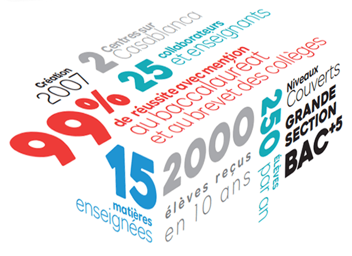

<main id="qui-sommes-nous" class="mb-0 pb-0">

  <section class="container mt-4 mt-sm-5 pt-5 pb-5">
    

      <h1 class="font-weight-normal">
        <strong>Nous connaître</strong>
      </h1>
    

    

      

        

          <strong>Opérateur majeur du soutien scolaire</strong> et de la formation à Casablanca, BOOKMANIA opère depuis <strong>10 ans</strong> et affiche fièrement un <strong>taux de réussite de 99% </strong>avec mention au baccalauréat et au brevet des collèges.
        

        

          Depuis 2007, nos 2 centres sur Casablanca ont accueilli et accompagné <strong>plus de 2000 élèves</strong> de la grande section aux cycles d’études supérieurs.
        

        

          Notre équipe composée de plus de 25 collaborateurs et enseignants est à la disposition des 250 élèves que nous accompagnons tous les ans.
        

        

          Aujourd’hui, avec le lancement de nos offres entreprises, nous nous engageons à mettre <strong>notre passion au service de nos clients </strong>corporate.
        

        

          N’hésitez pas à nous contacter ou nous rendre visite au sein de nos locaux pour nous exposer vos problématiques et vos attentes.
        

      

      

        
        <h5 class="mt-3">
          <strong class="font-weight-bold">Bookmania en chiffres</strong>
        </h5>
      

    

  </section>

</main>

