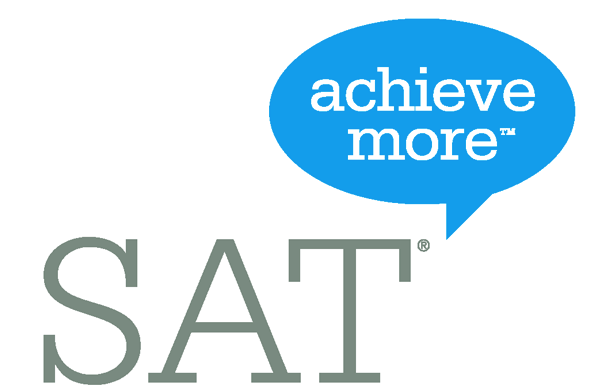

<main id="nos-metiers">

  <section class="container mt-4 mt-sm-5 pt-5 pb-4">

    

      <h1 class="mb-4 mb-md-0 font-weight-normal">
        <strong>S.A.T Casablanca</strong>
      </h1>
      
    

    <ul class="nav nav-tabs md-tabs" id="myTabEx" role="tablist">
      <li class="nav-item">
        <a class="nav-link active show" id="home-tab-ex" data-toggle="tab" href="#home-ex" role="tab" aria-controls="home-ex" aria-selected="true">FRANÇAIS 🇫🇷</a>
      </li>
      <li class="nav-item">
        <a class="nav-link" id="profile-tab-ex" data-toggle="tab" href="#profile-ex" role="tab" aria-controls="profile-ex" aria-selected="false">ENGLISH 🇬🇧</a>
      </li>
    </ul>

    

      <!-- FRENCH -->
      

        <h4><strong>Le SAT : Qu'est-ce que c'est ?</strong></h4>
        

          Le SAT, le Scholastic Assessment Test est un test créé, administré et géré par le <strong>College Board</strong> aux Etats-Unis <a href="https://www.collegeboard.org" target="_blank">www.collegeboard.org</a>. De nombreuses universités américaines et autres universités internationales exigent le passage de ce test dans leur <strong>processus d'admission</strong>. Il sert à évaluer de manière précise <strong>les connaissances en anglais en mathématiques.</strong>
        

        

          

            <h4><strong>Quand puis-je passer le SAT ?</strong></h4>
            

              Le SAT peut être passé <strong>plusieurs fois par an</strong>. Les dates limites d'inscription sont d'environ de deux mois avant la date d'épreuve.
            

            <h4>
              <strong>
                Quelles sont les différentes épreuves du SAT ?
              </strong>
            </h4>
            

              Le SAT est un test sous forme de <strong>questions à choix multiples</strong> et se compose de 3 divs : <strong>Expression Ecrite</strong> (Writing), <strong>Analyse de Textes</strong> (Critical reading), et <strong>Mathématiques</strong> (Mathematical reasoning) avec un score allant de 200 à 800 points par div, soit un score total de 600 à 2 400 points.
            

          

          

            
          

        

        <h4>
          <strong>Pourquoi le SAT est-il important ?</strong>
        </h4>
        

          A titre d'exemple, en 2013, la plupart des étudiants ayant intégré la prestigieuse université américaine Harvard ont eu un score <strong>moyen de 710 points par épreuve</strong>, soit une moyenne totale de 2 130 points. Les étudiants ayant intégré l'université américaine de Los Angeles UCLA (The University of California, Los Angeles) ont eu une moyenne avoisinant 590 points par épreuve, soit un total de 1 770 points.
        

        <h4><strong>Prérequis et difficultés du SAT</strong></h4>
        

          Les élèves souhaitant passer le SAT doivent avoir <strong>un bon niveau de compréhension et d'utilisation de la langue anglaise </strong>(Intermediate Level). La difficulté majeure du TEST résidant dans les temps de réponse accordé par question (45 secondes à une minute), l'élève doit avoir développé au préalable des réflexes efficaces. La durée totale du test est de 3 H 45 toutes épreuves confondues.
        

        <h4><strong>Préparation au SAT par Bookmania</strong></h4>
        

          Chez Bookmania, nous maîtrisons les différentes techniques et stratégies pour <strong>préparer efficacement ce test</strong>. Notre méthodologie assure à nos élèves d'améliorer leur niveau de départ pour atteindre leur objectif. Ils sont accompagnés par des professeurs hautement qualifiés, chacun dans leur spécialité et bénéficiant de plusieurs années d'expérience dans l'éducation au Maroc, en France et en Amérique du Nord.
        

        

          Chez Bookmania, nous guidons nos étudiants vers <strong>la réussite</strong> en les prenant en charge tout au long du processus : inscription au Test, préparation des différentes épreuves, passage d´un test blanc et passage de l'examen dans un des centres nationaux agréés par le College Board.
        

        <h4>
          <strong>Pourquoi choisir Bookmania pour le SAT ?</strong>
        </h4>
        

          Des sessions de préparation <strong>adaptées à votre niveau</strong> et à vos besoins vous seront proposées par nos spécialistes lors d'un premier entretien.
        

        

          Chez Bookmania, non seulement nous vous préparons à passer votre examen, mais nous <strong>vous accompagnons</strong> à travers toutes les démarches administratives nécessaires jusqu'à l'obtention de votre score, environ trois semaines après le passage de l'examen.
        

      

      <!-- ENGLISH -->
      

        <h4><strong>What is the SAT ?</strong></h4>
        

          The SAT is a test administered by the College Board<a href="https://www.collegeboard.org" target="_blank"> www.collegeboard.org</a>. It is a requirement for admission in several universities in the US and other universities worldwide. It informs college admissions of the abilities of students in mathematical reasoning and in the English language. The SAT consists of three sections of multiple choice questions: Critical Reading, Mathematics, and Writing, scored 200 to 800 points for each sections, or a total maximum points of 2400 (i.e. perfect score).
        

        

          

            <h4><strong>When am I able to take the SAT?</strong></h4>
            

              The SAT is proposed several times a year, and deadlines for admissions are roughly two months before the corresponding examination date.
            

            <h4><strong>Why is the SAT important?</strong></h4>
            

              For the sake of an example, most of Harvards newly admitted students in 2013 scored above 710 on average for each section, or a global average of 2130 points. In the same year, students enrolled in UCLA with score around an average of 590 per section, or a total 1770.
            

          

          

            
          

        

        <h4><strong>Difficulties of the SAT</strong></h4>
        

          English fluency (intermediate level) is expected for students taking the test. The allocated time for each question lies between 45 seconds and one minute, which makes lack of time the greatest difficulty of the test. Students should have developed test-taking strategies with the adequate level in English in order to finish this 3h45m test.
        

        <h4><strong>Preparing the SAT at Bookmania</strong></h4>
        

          At Bookmania, we have mastered the art of test taking. Our methodology, consisting of different techniques and strategies ensures that students will efficiently improve their level in every section of the SAT. They are accompanied by highly qualified instructors with many years of teaching experience in Morocco and North America.
        

        

          Bookmania and its team of experts in the American Educational System have the tools to assist you during your registration to the SAT, your preparation for the test, until the day of your test in one of the College Board accredited examination centers.
        

        <h4><strong>Why Bookmania for the SAT?</strong></h4>
        

          Courses in all three sections are given by professionals of the SAT in order to provide the adequate support that will be adapted to your level. A preparation plan will be designed to meet your needs during an initial appointment.
        

      

    

  </section>

  

</main>

