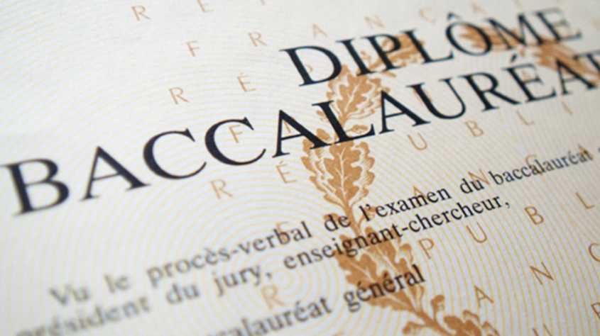
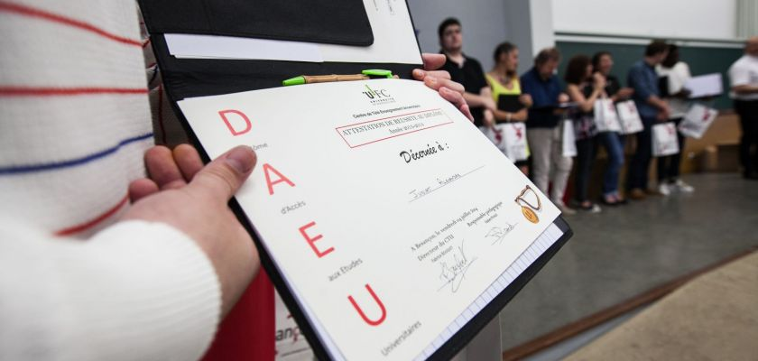

<main id="nos-metiers" class="tests-et-concours">

  <section class="container mt-4 mt-sm-5 pt-5 pb-4 pb-sm-5">
    

      <h1 class="font-weight-normal">
        <strong>Tests et concours</strong>
      </h1>
    

    <h5 class="pb-3 pb-sm-4"><strong>Les clés de la réussite</strong></h5>
    

      Que ce soit en cours particuliers ou en stages pour groupe restreint, notre approche nous permet d’outiller au mieux nos élèves pour leur permettre de passer avec succès leurs concours et tests d’accès.
    

  </section>

  <section class="blue-grey lighten-5 pt-5 pb-2">
    

      

        

          

            

              <a href="{{site.baseurl}}/mission-francaise.php">
                
                

              </a>
            

            

              <h5>
                Préparation du test d’admission à
                <strong>la mission française</strong>
              </h5>
              

                Nous préparons vos enfants dans les meilleures conditions au test d'admission à la Mission française et écoles homologuées.
              

              <a href="{{site.baseurl}}/mission-francaise.php" class="btn btn-outline-primary">
                <strong>Lire la suite</strong>
              </a>
            

          

        

        

          

            

              <a href="">
                
                

              </a>
            

            

              <h5>
                Préparation du BAC en
                 
                <strong>candidat libre</strong>
              </h5>
              

                Pour les élèves non scolarisés, nous proposons un programme spécifique pour préparer le Baccalauréat type Mission en candidat libre.
              

              <a href="" class="btn btn-outline-primary">
                <strong>Lire la suite</strong>
              </a>
            

          

        

        

          

            

              <a href="{{site.baseurl}}/test-sat-casablanca.php">
                
                

              </a>
            

            

              <h5>
                <strong>Préparer</strong> le S.A.T
              </h5>
              

                Nous organisons des sessions intensives de préparation du SAT (Scholastic Assessment Test), exigé par de nombreuses universités américaines.
              

              <a href="{{site.baseurl}}/test-sat-casablanca.php" class="btn btn-outline-primary">
                <strong>Lire la suite</strong>
              </a>
            

          

        

        

          

            

              <a href="{{site.baseurl}}/daeu-casablanca.php">
                
                

              </a>
            

            

              <h5>
                Diplôme d’Accès aux <strong>Études Universitaires</strong>
              </h5>
              

                Le DAEU est un diplôme équivalent au Baccalauréat Français permettant d’offrir une deuxième chance aux jeunes ayant été déscolarisés.
              

              <a href="{{site.baseurl}}/daeu-casablanca.php" class="btn btn-outline-primary">
                <strong>Lire la suite</strong>
              </a>
            

          

        

      

    

  </section>

</main>
